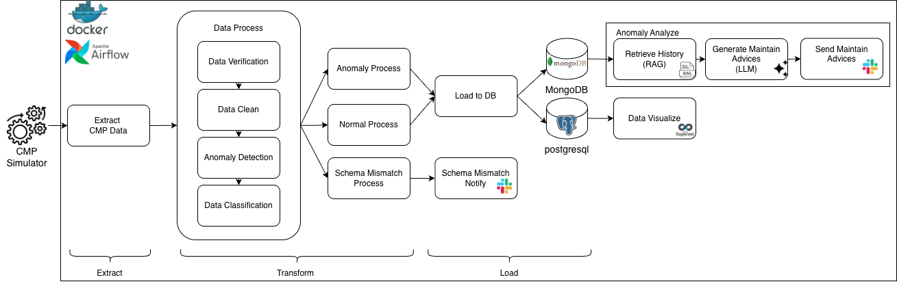
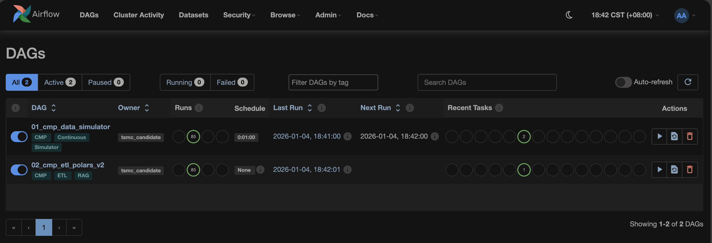
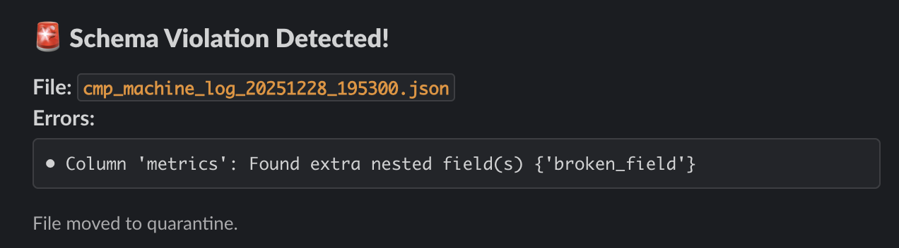
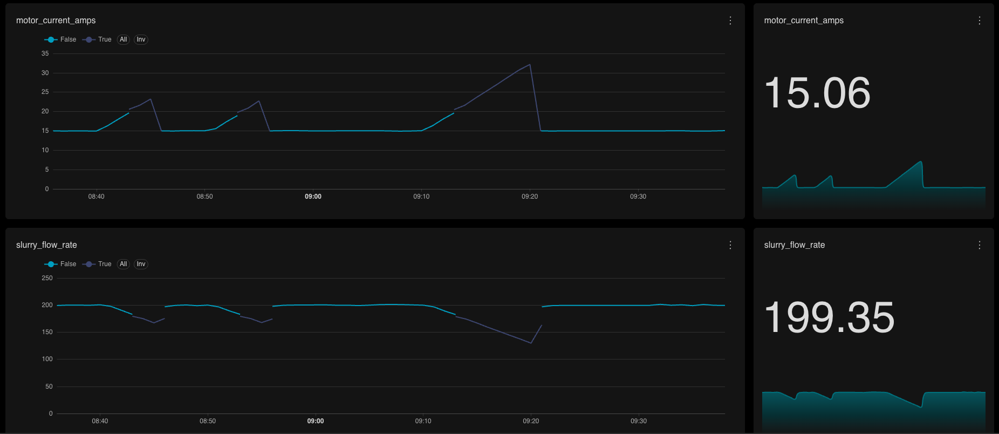

# CMP ETL + RAG Pipeline

> A real-time CMP (Chemical Mechanical Polishing) sensor data pipeline with anomaly detection, RAG-powered diagnostics, and automated Slack alerting — built for semiconductor manufacturing scenarios.



## Overview

This project simulates a semiconductor fab CMP equipment monitoring system. Sensor data flows through an Airflow-orchestrated ETL pipeline that validates schemas, detects anomalies, and uses a RAG (Retrieval-Augmented Generation) agent to query historical repair records and generate maintenance recommendations via LLM.

## Tech Stack

- **Orchestration**: Apache Airflow (DAG scheduling, task management)
- **Data Processing**: Polars (high-performance DataFrame)
- **Databases**: PostgreSQL (analytics) + MongoDB Atlas (anomaly store + vector search)
- **AI/RAG**: Gemini API (embedding + LLM generation)
- **Visualization**: Apache Superset
- **Notification**: Slack Webhooks
- **Infra**: Docker Compose, GitHub Actions CI/CD
- **Containerization**: Docker Compose

## Features

- **Data Simulation**: State-machine-based CMP sensor simulator with normal / degrading / clogging modes
- **Schema Validation**: Recursive deep-scan that catches missing fields, extra fields, and type mismatches in nested structs
- **Anomaly Detection**: Real-time filtering of abnormal sensor readings with dual-database persistence
- **RAG Diagnostics**: Embeds anomaly context → vector search historical repairs → LLM generates root cause analysis and fix recommendations
- **Slack Alerting**: Rich-format notifications for both schema violations and AI-powered anomaly diagnosis
- **CI/CD**: GitHub Actions pipeline with lint (ruff) → test (pytest) → build (Docker) → push to GHCR

## Architecture

```
[Simulator DAG] → [Raw JSON Logs]
                        │
                  [ETL Pipeline DAG]
                        │
         ┌──────────────┼──────────────┐
         │              │              │
   Schema Check    Anomaly Detect   Archive
     │    │             │
  Slack  Quarantine     ├─→ PostgreSQL (Superset)
  Alert               ├─→ MongoDB Atlas
                       └─→ RAG Agent → LLM → Slack Alert
```

## Getting Started

```bash
git clone https://github.com/YOUR_USERNAME/cmp-etl-pipeline.git
cd cmp-etl-pipeline

# 1. Set up environment variables
cp .env.example .env
# Edit .env with your actual keys (MongoDB URI, Gemini API Key, Slack Webhooks)

# 2. Initialize MongoDB knowledge base (one-time)
pip install pymongo certifi requests python-dotenv
python init_mongo.py

# 3. Start all services
docker compose up -d

# 4. Open Airflow UI
# http://localhost:8081  (admin / admin)
# Enable and trigger DAG: 01_cmp_data_simulator
```

## Testing

```bash
pip install -r requirements.txt -r requirements-dev.txt
pytest tests/ -v
```

## Project Structure

```
├── dags/                    # Airflow DAGs
│   ├── 01_cmp_simulation_dag.py   # Sensor data simulator
│   └── 02_cmp_etl_pipeline.py     # ETL main pipeline
├── plugins/                 # Reusable modules
│   ├── config.py            # Centralized settings (env vars)
│   ├── schema_validator.py  # Schema validation
│   ├── anomaly_detector.py  # Anomaly detection
│   ├── rag_agent.py         # RAG + LLM engine
│   └── notifier.py          # Slack notifications
├── tests/                   # Unit tests (pytest)
├── knowledge/               # Static repair knowledge base
├── .github/workflows/       # CI/CD pipeline
└── docker-compose.yaml      # Local dev environment
```

## Screenshots

| Airflow DAG | Slack Alert |
|-------------|-------------|
|  |  |

| Superset Dashboard |
|--------------------|
|  |

## License

MIT
